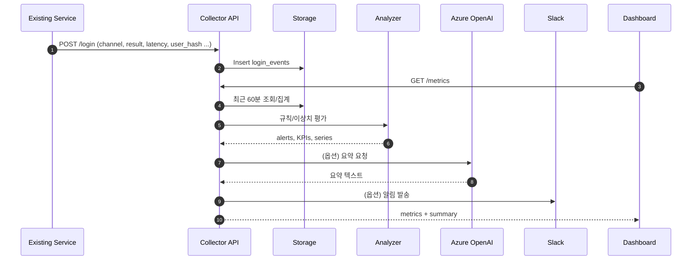

# Login Control Service

접속 URL: https://streamlit-login-control.azurewebsites.net/

> **목표**  
> 현재 운영 중인 로그인/인증 서비스에 **이상 징후 탐지·요약·알림** 능력을 더해 **운영 가시성**과 **사고 대응 속도**를 높이는 경량 플랫폼입니다.

---

## 1) 프로젝트 개요

- 로그인 이벤트를 수집하여 **분 단위 시계열**로 집계하고, **규칙+ML 기반**으로 이상을 감지합니다.  
- 운영자가 보는 **대시보드(Streamlit)**, **AI 요약(Azure OpenAI)**, **Slack 알림**을 기본 제공합니다.  
- **FastAPI 기반 마이크로서비스**로 독립 배포 가능하다.

**핵심 가치**
- 사고 조기 탐지(실패율 급증/이상 패턴)
- 운영 인사이트 자동 요약 → **의사결정 가속**
- 경량 도입(파일 DB로 시작, 점진적 확장) → **도입 리스크/비용 최소화**

---

## 2) 핵심 기능

- **수집(API)**: `POST /login` 로 이벤트 수집(실 서비스 연동 시 실제 인증 결과 전달)
- **집계/분석**: 최근 ~60분 **1분 해상도** 집계(KPI, 채널별, 추세) + **IsolationForest** 기반 이상치 점수
- **규칙 알림**: 예) 실패율 스파이크(`fail_rate > 40%` and `attempts ≥ 30`)
- **요약(AI)**: 운영 관점 **한국어 요약** 자동 생성(모델/엔드포인트 교체 가능)
- **알림(Slack)**: Block Kit 포맷으로 심각도/메시지/KPI 전달
- **대시보드**: KPI/추세/채널/알림/요약을 카드형 UI로 제공(수동 갱신)

---

## 3) 서비스 동작(요약)

---

## 4) 기술 스택

- **Backend**: FastAPI, Uvicorn/Gunicorn (Python 3.11)  
- **ML/분석**: pandas, numpy, scikit‑learn (IsolationForest)  
- **Frontend**: Streamlit(+간단 CSS), Plotly  
- **Storage**: SQLite(기본) → **Azure Database for PostgreSQL**(운영)  
- **AI**: Azure OpenAI (요약)  
- **Alerting**: Slack Webhook (Block Kit)  
- **Infra**: Azure App Service (Linux), Oryx Build  
- **CI/CD**: GitHub Actions (`azure/appservice-build@v3`, `azure/webapps-deploy@v3`)

---

## 5) 운영 구성 & 베스트 프랙티스

- **App Service 실행**  
  - FastAPI: 시작 커맨드에서 `gunicorn -w 1 -k uvicorn.workers.UvicornWorker` (파일 DB 잠금 최소화)  
  - Streamlit: `streamlit run ...` (API 읽기 전용)  
- **경로/권한**  
  - Azure에서는 쓰기 가능한 `/home/site/data`에 DB 저장(코드에서 기본값)  
- **환경 변수(예시)**  
  - `ENABLE_BG_TRAFFIC=0` (운영에선 기본 OFF)  
  - `AZURE_OPENAI_*`, `SLACK_WEBHOOK_URL`  
  - `DB_URL` 또는 `DB_PATH`(운영 DB 전환 시)  
- **보안**  
  - `/metrics`는 내부망/인증 보호 권장, 키/토큰은 App Settings/Key Vault 관리  
  - PII 비저장: `user_hash` 등 비식별화 유지  
- **관찰성**  
  - App Service 로그/컨테이너 로그 활성화, 알림 임계값/채널 운영 합의

---
